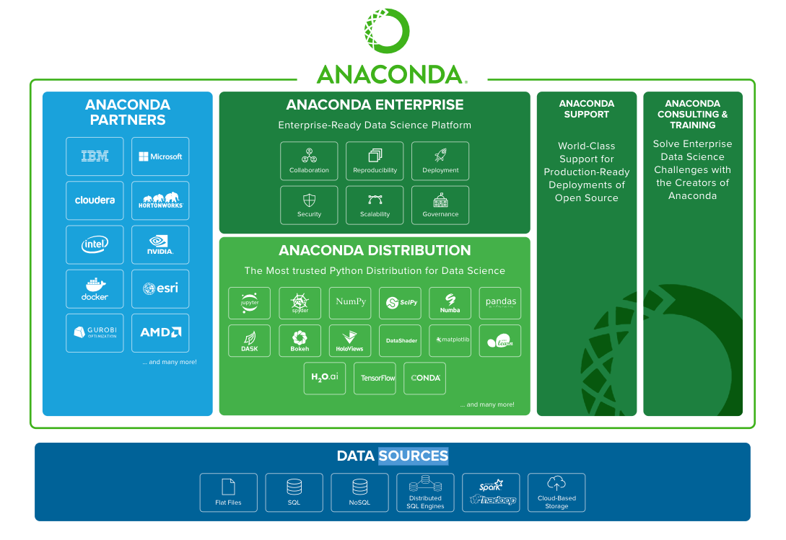
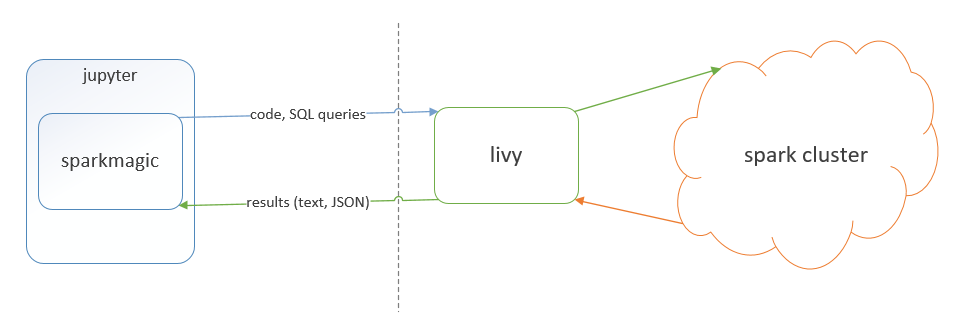

# Anacondo and Jupyter

Anaconda is the world's most popular Python data science platform. 



Download/install Anacondo from [https://www.anaconda.com/download/] . Jupyter will be installed by Anaconda automatically. 

The command ```jupyter kernelspec list``` shows what kernels are installed and where they are located.

Change the directory to the kernel installation location, there is a file called ```kernel.json``` which defines the configuration for each kernel.


# Jupyter with sparkmagic kernel
  


## Livy

Download Livy from [http://livy.incubator.apache.org/download/]

Install Livy somewhere could access to Spark and be accessed by the browser. Suggest installing in the same machine as spark master. If Spark master is installed on a docker container, this container should expose Livy's port(8998)

Change the directory to ```${livy_installation_path}/conf```, run command ```cp livy-env.sh.tempmlate livy-env.sh``` and ```cp livy.conf.template livy.conf```

Edit ```livy.conf```, change ```livy.spark.mastger```, for example: 
```
livy.spark.master = spark://locahost:7077
```

To start livy server, run the command:
```
./bin/livy-server
```

To check livy server status, run the command:
```
curl localhost:8998/sessions
```

## sparkmagic

```
pip install sparkmagic
jupyter nbextension enable --sys --sys-prefix widgetsnbextension
```

copy [https://github.com/jupyter-incubator/sparkmagic/blob/master/sparkmagic/example_config.json](https://github.com/jupyter-incubator/sparkmagic/blob/master/sparkmagic/example_config.json) to ```~/.sparkmagic/config.json```, this configuration file defines how sparkmagic finds Livy installation

```jupyter serverextension enable --py sparkmagic```

Note:

sparkmagic generates a SparkSession named ```spark```

## sparkmagic with docker support
TODO 

# Jupyter with Toree kernel

We need to compile Toree from ground up to talk to Spark 2.x(compiled with Scala-2.11)

Download the source: ```git@github.com:apache/incubator-toree.git ```

Set environment variable ```APACHE_SPARK_VERSION=2.2.0```

```make pip-release``` generates artifacts under the directory ```${toree_dir}/dist```

```
pip install dist/toree-pip/toree-0.2.0.dev1.tar.gz
jupyter toree install --replace --spark_home=$SPARK_HOME --spark_opts="--master=${spark-url}" --interpreters=Scala,PySpark,SparkR,SQL
```

Note:
Toree generates a SparkContext named ```sc```

## toree with docker support
TODO

# Jupyter with spylon kernel

Spylon is a Scala jupyter kernel that uses metakernel in combination with Py4j

```
pip install spylon-kernel
python -m spylon_kernel install
```

By default, Spylon will be looking at ```SPARK_HOME``` environment variable

Spylon generates a SparkSession named ```spark```