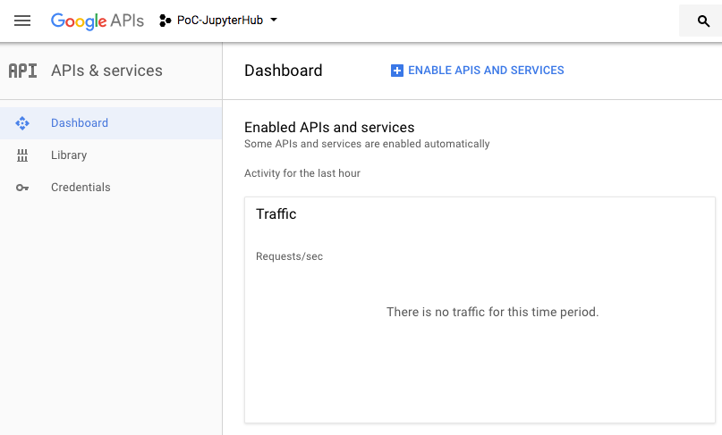

# JupyterHub On Mac


## Install Anaconda and Jupyter Notebook

Refer to [Jupyter-and-Spark-Kernel.md](Jupyter-and-Spark-Kernel.md)

## Install JupyterHub

```
conda install -c conda-forge jupyterhub  # installs jupyterhub and proxy
conda install notebook  # needed if running the notebook servers locally
```
To allow multiple users to sign in to the Hub server, start the Hub server with root privilege:

```sudo jupyterhub --ip ${ip address}```

Visit ```http://${ip address}:8000``` in the browser, and sign in with the unix credentials

## Configure JupyterHub

### Generate the default configuration file

On startup, JupyterHub will look by default for a configuration file called ```jupyterhub_config.py```, in the current work directory
 
To generate a default config file, run the command: ```jupyter --generate-config```

### Start with a specific config file

```jupyterhub -f /path/to/jupyterhub_config.py``` 

## Authentication and Users

### Create the users

Better to create the users in your hosting system(VMs or bare metal machines) before starting the Hub server.

```sudo useradd -m -g ${group-name} ${user-name}```

Then set a password
```passwd ${user-name}```

You must use any users who already exist in the hosting system to login to the Hub server

If you login as admin, and then you would like to add the users at the admin control panel, the users you add must exist in the hosting system too

### Configure the authentication and users

Edit ```jupyterhub_config.py```

```c.Authenticator.whitelist = {'mal', 'zoe', 'inara', 'kaylee'}``` restricts which users are allowed to login. Users in the whitelist are added to the Hub database when the Hub is started

```c.Authenticator.admin_users = {'mal', 'zoe'}``` defines admin users of JupyterHub. ```admin_users``` can add or remove users from the user ```whitelist```

By default ```c.JupyterHub.admin_access``` is False, the admins do not have permission to log in to the single user notebook servers owned by other users

## Spawners and single-user notebook server

The single-user server is an instance of jupyter notebook.
 
```c.Spawner.notebook_dir = '/Users/{username}/work/jupyter'``` defines the path to the notebook directory for the single-user server. ```{username}``` will be replaced with the name of the user


## OAuthenticator

OAuth + JupyterHub Authenticator = OAuthenticator
[https://github.com/jupyterhub/oauthenticator](https://github.com/jupyterhub/oauthenticator)

### Installation

```pip install oauthenticator```, here ```pip``` resides in Anaconda path and it is for python 3

```pip install dockerspawner```, then edit ```jupyterhub_config.py``` to add the following line ```c.JupyterHub.spawner_class = 'dockerspawner.DockerSpawner'```
Run the following command ```docker pull jupyter/all-spark-notebook``` on the VM or machine running the Hub server

### Create OAuth Client ID from Google
Visit [https://console.developers.google.com](https://console.developers.google.com) to create OAUth 2.0 client credentials.

Log in to Google account, create your own project and name it. 

In Dashboard, click ```+ENABLE APIS AND SERVICES button``` to nevigate to API Library page, and enable Google IAM service


Click ```Credentials``` button on the left of Dashboard page. Create OAuth client ID and get client_id and client_secret

Edit ```jupyterhub_config.py```, add the following lines:
```
from oauthenticator.google import GoogleOAuthenticator
c.JupyterHub.authenticator_class = GoogleOAuthenticator
c.GoogleOAuthenticator.oauth_callback_url='http://localhost:8000/hub/oauth_callback'
c.GoogleOAuthenticator.client_id = '${client_id}' ## copy client_id from Google Credentials page
c.GoogleOAuthenticator.client_secret = '${client_secret}'  ## copy client_secret from Google Credentials
```
By configuring the above info, you enable users to log in with their Google Account. No local unix users needed.

### DockerSpawner

[https://github.com/jupyterhub/dockerspawner](https://github.com/jupyterhub/dockerspawner)
[https://github.com/jupyter/docker-stacks](https://github.com/jupyter/docker-stacks)
```
c.JupyterHub.spawner_class = 'dockerspawner.DockerSpawner'
c.DockerSpawner.host_ip = "0.0.0.0"
c.DockerSpawner.image = 'jupyter/all-spark-notebook'
```

To allow single-user notebook server started with docker contain to access to the Hub server, set ```c.JupyterHub.hub_ip = '${non-localhost-ip-address}'```